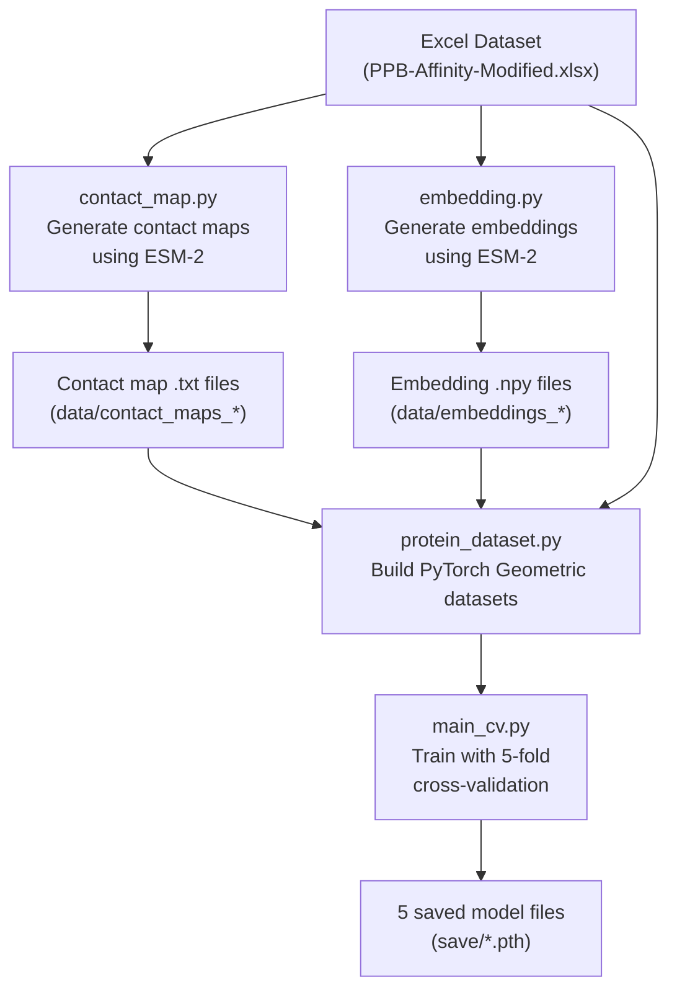
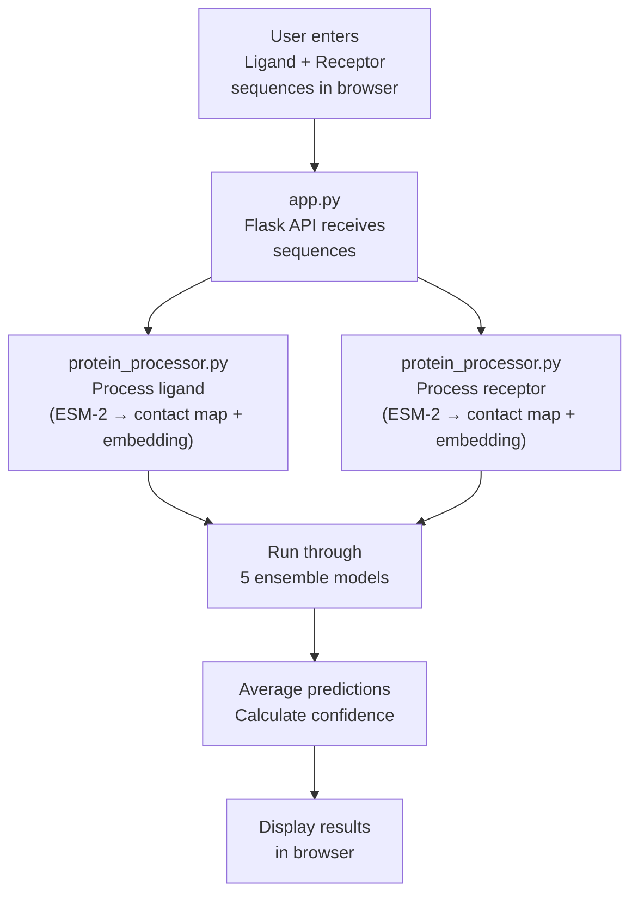

# CrossPPI — Complete Project Explanation

> [!NOTE]
> This document explains every part of the project in detail. Technical words are **bolded** the first time they appear, with their meaning explained right away. By the end, you will understand what the project does, why it exists, and how every file works together.

---

## 1. What Does This Project Do? (The Big Picture)

This project is called **CrossPPI**. It predicts **how strongly two proteins stick to each other**.

### Why does that matter?

Your body is made of trillions of tiny machines called **proteins** — they carry oxygen in your blood (hemoglobin), fight infections (antibodies), digest food (enzymes), etc. Proteins rarely work alone. They physically **bind** (attach/stick) to each other to do their job. For example, when a virus enters your body, your antibody protein *binds* to the virus's surface protein to neutralize it.

Scientists need to know:
- **Do** these two proteins bind?
- **How strongly** do they bind?

Knowing the binding strength helps in:
- **Drug design** — making medicines that block harmful protein interactions
- **Understanding diseases** — many diseases involve proteins binding incorrectly
- **Bioengineering** — designing new proteins for industrial or medical use

### What does "binding affinity" mean?

**Binding affinity** is a number that tells you how tightly two proteins grab onto each other. Think of it like the strength of a handshake — a firm handshake means high affinity, a weak one means low affinity.

This project specifically predicts a value called **pKd** (pronounced "p-K-D"):
- **Kd** stands for **dissociation constant** — it measures how easily two proteins *separate* after binding. A very small Kd means they hold on very tightly.
- **pKd** is just `-log10(Kd)`. The "p" works like pH in chemistry — it flips the scale so that **higher pKd = stronger binding**.
- Typical pKd values range from about **2** (very weak) to **12+** (extremely tight).

### Summary of the goal

> **Input:** Two protein sequences (strings of letters like `ACDEFGHIKLMNPQRSTVWY`, where each letter represents one **amino acid** — a building block of a protein)
>
> **Output:** A pKd number predicting how strongly the two proteins bind

---

## 2. The Two Proteins: Ligand and Receptor

Throughout this project, the two proteins being studied are called:

| Term | Meaning |
|------|---------|
| **Ligand** | The smaller protein that "docks" onto the other. Think of it as a key. |
| **Receptor** | The larger protein that receives the ligand. Think of it as a lock. |

When a ligand binds to a receptor, they form a **protein-protein interaction (PPI)** — hence the name Cross**PPI**.

---

## 3. How Is a Protein Represented in This Project?

A protein is a chain of **amino acids**. There are 20 standard amino acids, each represented by a single letter:

```
A, C, D, E, F, G, H, I, K, L, M, N, P, Q, R, S, T, V, W, Y
```

Plus `X` for any unknown/non-standard amino acid (21 total).

So a protein sequence looks like: `TEFGSELKSFPEVVGKTVDQAREYFTL...`

But a raw letter sequence alone doesn't capture the full picture. The project represents each protein in **three different ways** and then combines them. This is the key innovation.

### 3.1 Representation #1: Sequence Embeddings (from ESM-2)

**What is an embedding?**
An embedding is a way to convert something (like a word or an amino acid) into a list of numbers that captures its *meaning*. For example, the word "king" might become `[0.5, -0.2, 0.8, ...]` — a vector (list) of numbers. Similar things get similar numbers.

**What is ESM-2?**
**ESM-2** (Evolutionary Scale Modeling 2) is a **pre-trained protein language model** built by Facebook/Meta AI Research. Just like ChatGPT learns patterns in human language, ESM-2 learned patterns in protein sequences by reading millions of protein sequences from nature. It understands which amino acids tend to appear together, which parts of a protein are important, etc.

When you feed a protein sequence into ESM-2, it outputs a **1280-dimensional embedding** for each amino acid position. "1280-dimensional" means each amino acid is described by a list of 1280 numbers — like a 1280-feature fingerprint.

**File:** [embedding.py](file:///c:/Users/lahar/Downloads/rtrp-final-final/G-1079_Experimental%20Fusion-20260605T143253Z-3-001/G-1079_Experimental%20Fusion/embedding.py)
- Reads protein sequences from the Excel dataset
- Feeds each sequence into ESM-2
- Saves the per-residue embeddings as `.npy` files (a NumPy array file format)

### 3.2 Representation #2: Contact Map → Graph (Structure)

**What is a contact map?**
A protein sequence folds into a 3D shape. A **contact map** is a square grid (matrix) where each cell `[i, j]` tells you whether amino acid `i` is physically close to amino acid `j` in 3D space. If they're close → 1, if not → 0.

Think of it like a seating chart: if person i and person j are sitting next to each other, you mark that cell as 1.

**How is it generated?**
ESM-2 can also *predict* contact maps just from the sequence (no need for an actual 3D structure). The project uses a **threshold** of 0.5 — if ESM-2 says there's a >50% chance two amino acids are in contact, it marks them as 1 (in contact), otherwise 0 (not in contact). This is called **binarization** (turning continuous probabilities into binary 0/1 values).

**File:** [contact_map.py](file:///c:/Users/lahar/Downloads/rtrp-final-final/G-1079_Experimental%20Fusion-20260605T143253Z-3-001/G-1079_Experimental%20Fusion/contact_map.py)
- Reads protein sequences from the Excel dataset
- Uses ESM-2 to predict contact maps
- Binarizes them with threshold 0.5
- Saves them as `.txt` files

**What is a graph?**
A **graph** is a mathematical structure made of **nodes** (dots) and **edges** (lines connecting dots). In this project:
- Each **node** = one amino acid in the protein
- Each **edge** = a contact (physical closeness) between two amino acids

So the contact map is converted into a graph: wherever the matrix has a `1`, an edge is drawn between those two amino acid nodes.

### 3.3 Representation #3: One-Hot Encoding (Simple Identity)

**One-hot encoding** is the simplest way to represent each amino acid — assign it a number from 0 to 20 (like an ID). `A=0, C=1, D=2, ... Y=19, X=20`. This is used as the initial "identity" of each node in the graph.

---

## 4. The Dataset

**File:** [PPB-Affinity-Modified(pkd).xlsx](file:///c:/Users/lahar/Downloads/rtrp-final-final/G-1079_Experimental%20Fusion-20260605T143253Z-3-001/G-1079_Experimental%20Fusion/data/PPB-Affinity-Modified(pkd).xlsx)

This is an **Excel spreadsheet** containing the training data. Each row represents one known protein-protein interaction with columns like:

| Column | What it contains |
|--------|-----------------|
| `Complex ID` | A unique identifier for each protein pair |
| `Ligand Chains` | The amino acid sequence of the ligand protein |
| `Receptor Chains` | The amino acid sequence of the receptor protein |
| `KD(M)` | The actual measured pKd value (the "ground truth" the model learns from) |
| `PDB` | The Protein Data Bank ID (a global database of protein structures) |

---

## 5. Data Processing Pipeline (Preparing Data for the AI)

Before the AI model can learn, the raw data needs to be transformed into the three representations described above. Here's how the files work together:

### Step 1: Generate Contact Maps
```
contact_map.py → reads Excel → uses ESM-2 → saves .txt files in data/contact_maps_ligands/ and data/contact_maps_receptor/
```

### Step 2: Generate Embeddings
```
embedding.py → reads Excel → uses ESM-2 → saves .npy files in data/embeddings_ligands/ and data/embeddings_receptor/
```

### Step 3: Build PyTorch Geometric Datasets

**What is PyTorch?**
**PyTorch** is a popular open-source **deep learning framework** — a library (toolkit) that provides tools to build, train, and run AI models. Think of it as a workshop with all the tools you need to build an AI.

**What is PyTorch Geometric?**
**PyTorch Geometric** is an extension of PyTorch specifically designed for **graph neural networks (GNNs)** — AI models that work on graph-structured data (nodes + edges).

**File:** [protein_dataset.py](file:///c:/Users/lahar/Downloads/rtrp-final-final/G-1079_Experimental%20Fusion-20260605T143253Z-3-001/G-1079_Experimental%20Fusion/data/protein_dataset.py)

This is the main dataset builder. For each protein in the Excel sheet, it:
1. Reads the amino acid sequence
2. Loads the pre-generated contact map (`.txt`) → converts it to graph edges
3. Converts the sequence to one-hot encoding → becomes graph node features
4. Loads the pre-generated ESM-2 embedding (`.npy`)
5. Packages everything into a `Data` object (a PyTorch Geometric container) with:
   - `x` — node features (one-hot encoded amino acids)
   - `edge_index` — which nodes are connected (from contact map)
   - `emb` — ESM-2 embeddings
   - `y` — the actual pKd value (what we want to predict)
   - `protein_len` — number of amino acids

**Files:** [process_ligands.py](file:///c:/Users/lahar/Downloads/rtrp-final-final/G-1079_Experimental%20Fusion-20260605T143253Z-3-001/G-1079_Experimental%20Fusion/data/process_ligands.py) and [process_receptors.py](file:///c:/Users/lahar/Downloads/rtrp-final-final/G-1079_Experimental%20Fusion-20260605T143253Z-3-001/G-1079_Experimental%20Fusion/data/process_receptors.py)
- These are earlier/alternative versions of the dataset builder, hard-coded for ligands and receptors respectively. The unified `protein_dataset.py` replaced them.

---

## 6. The AI Model Architecture (The Brain)

This is the most important part. The model has **four major components**:

### 6.1 Component 1: Protein Feature Extraction (one per protein)

**File:** [gnn_model_protein.py](file:///c:/Users/lahar/Downloads/rtrp-final-final/G-1079_Experimental%20Fusion-20260605T143253Z-3-001/G-1079_Experimental%20Fusion/model/gnn_model_protein.py)

Each protein (ligand and receptor) goes through its own feature extractor. This module produces **two views** of the protein:

#### View A: Graph View (structural features)
Uses a **GNN** (Graph Neural Network) called **GAT** (Graph Attention Network):
- **GAT** works by passing messages between connected nodes in the graph. Each node "talks to" its neighbors and updates its understanding based on what its neighbors know.
- **Attention** means the model learns to pay *more attention* to certain neighbors and less to others (like how you pay more attention to a friend whispering important info than to background noise).
- The model uses **3 layers** of GAT convolutions, progressively refining the features.
- Output: a feature vector for each amino acid node, capturing its **structural context** (which other amino acids it's physically close to).

#### View B: Sequence View (sequential features)
Uses a **1D CNN** (1-Dimensional Convolutional Neural Network):
- **CNN** stands for Convolutional Neural Network. "Convolution" is a mathematical operation that slides a small window (called a **kernel** or **filter**) across the sequence and detects patterns.
- **1D** means it slides in one direction (along the amino acid chain), unlike 2D CNNs used for images.
- Three different kernel sizes are used: **7, 11, and 15** amino acids wide. Smaller kernels detect short-range patterns; larger kernels detect longer-range patterns. Their outputs are averaged together.
- Before the CNN, the ESM-2 embeddings (1280-dim) are compressed to 128-dim using a **linear layer** (a simple mathematical transformation: `output = weight × input + bias`).
- The compressed embeddings are combined (averaged) with the one-hot node embeddings, then fed through the CNN.
- Output: a feature vector for each amino acid, capturing its **sequential context** (patterns in the order of amino acids).

#### Final outputs from this module (per protein):
| Output | What it is |
|--------|-----------|
| `out_seq_cnn` | Sequence features for every amino acid (from CNN) |
| `out_graph` | Graph features for every amino acid (from GAT) |
| `mask_seq` / `mask_graph` | Binary masks indicating which positions are real amino acids vs. padding |
| `emb_seq` | A single summary vector for the whole protein's sequence features |
| `emb_graph` | A single summary vector for the whole protein's graph features |

**What is padding and masking?**
Proteins have different lengths. To process them together in a batch, shorter proteins are padded with zeros to match the longest one. A **mask** is a list of 1s and 0s: `1` means "this is a real amino acid," `0` means "this is just padding, ignore it."

### 6.2 Component 2: Cross-Fusion Module (The Core Innovation)

**File:** [cross_attention.py](file:///c:/Users/lahar/Downloads/rtrp-final-final/G-1079_Experimental%20Fusion-20260605T143253Z-3-001/G-1079_Experimental%20Fusion/model/cross_attention.py)

This is what makes CrossPPI special. Instead of looking at each protein separately, this module makes them **look at each other**.

#### What is Cross-Attention?

Normal **self-attention** means "each amino acid in Protein A looks at other amino acids in Protein A to understand context." **Cross-attention** means "each amino acid in Protein A looks at amino acids in Protein B" — and vice versa.

Imagine two people reading each other's minds to understand how they'll interact. That's cross-attention.

#### How does it work technically?

Cross-attention uses three concepts called **Query (Q)**, **Key (K)**, and **Value (V)**:

| Concept | Analogy |
|---------|---------|
| **Query (Q)** | "What am I looking for?" — the question asked by each amino acid |
| **Key (K)** | "What do I contain?" — the label/tag on each amino acid in the other protein |
| **Value (V)** | "What information do I carry?" — the actual information in each amino acid of the other protein |

The attention mechanism works like a search engine:
1. Each amino acid in the **receptor** creates a Query
2. Each amino acid in the **ligand** creates Keys and Values
3. The Query is matched against all Keys (using dot product — a mathematical similarity score)
4. The matches determine how much of each Value to pick up
5. This produces a new representation of the receptor that is *informed by the ligand*
6. The same process happens in reverse (ligand queries look at receptor keys/values)

This is done with **4 attention heads** — meaning 4 parallel attention computations, each focusing on different aspects of the interaction. The hidden dimension (128) is split into 4 parts of 32 each.

#### Multi-layer processing

The cross-attention is repeated **4 times** (4 **transformer layers**). Each layer refines the cross-attention further, like having 4 rounds of "mind reading."

Each layer also includes:
- **Residual connections** (Add): adding the input back to the output so information doesn't get lost
- **Layer Normalization** (Normalize): scaling values to a stable range so training is smoother
- **Feed-forward network**: an extra processing step (Linear → ReLU → Linear) after attention

#### Modality Embeddings

Before cross-attention, a **modality embedding** is added:
- Sequence features get embedding `0`
- Graph features get embedding `1`

This tells the model "this information came from the sequence view" vs. "this came from the graph/structure view" — so it can treat them appropriately even though they're combined together.

#### Input combination

For each protein, the sequence features and graph features are **concatenated** (joined end-to-end):
```
Ligand combined = [Ligand sequence features] + [Ligand graph features]
Receptor combined = [Receptor sequence features] + [Receptor graph features]
```

Then cross-attention operates between these combined representations.

### 6.3 Component 3: Affinity Prediction Module (The Final Answer)

After cross-fusion, the model needs to produce a single pKd number. Here's how:

1. **Average pooling with masks**: For each protein, take the average of all amino acid features (ignoring padding positions using the mask). This collapses "features for every amino acid" into "one feature vector for the whole protein."

2. **Combine with original features**: Average the cross-attention output with the original sequence and graph summary vectors. This ensures the model doesn't forget what it learned before cross-attention.

3. **MLP (Multi-Layer Perceptron)**: Pass through a small neural network:
   - `128 → 512 → 128` (with **ReLU activation** and **dropout**)
   - **ReLU** (Rectified Linear Unit) = `max(0, x)`. It introduces **non-linearity** — without it, stacking layers would be useless because multiple linear transformations collapse into one.
   - **Dropout** = randomly sets 20% of values to zero during training. This forces the model to not rely on any single feature, preventing **overfitting** (memorizing training data instead of learning general patterns).

4. **Concatenate ligand and receptor vectors**: Join the two 128-dim vectors into one 256-dim vector.

5. **Final prediction layers**:
   - `256 → 1024 → 512 → 1` (with ReLU and Dropout)
   - The final output is a single number: the predicted **pKd**.

### 6.4 The Complete Model: PPI Class

**File:** [main_cv.py](file:///c:/Users/lahar/Downloads/rtrp-final-final/G-1079_Experimental%20Fusion-20260605T143253Z-3-001/G-1079_Experimental%20Fusion/main_cv.py) (lines 74–133)

The `PPI` class wires everything together:
```
Ligand sequence → Feature Extraction ──────┐
                                            ├──→ Cross-Fusion → Pooling → MLP → Concatenate → Final MLP → pKd
Receptor sequence → Feature Extraction ─────┘
```

---

## 7. Training the Model

**File:** [main_cv.py](file:///c:/Users/lahar/Downloads/rtrp-final-final/G-1079_Experimental%20Fusion-20260605T143253Z-3-001/G-1079_Experimental%20Fusion/main_cv.py)

### What is training?

**Training** is the process where the AI model learns from examples. It sees many protein pairs with known pKd values, makes predictions, checks how wrong it was, and adjusts itself to be less wrong next time.

### Hyperparameters (settings)

| Setting | Value | Meaning |
|---------|-------|---------|
| `BATCH_SIZE = 32` | Process 32 protein pairs at a time |
| `EPOCH = 400` | Go through the entire dataset 400 times |
| `hidden_dim = 128` | The size of internal feature vectors |
| `LR = 5e-4` (0.0005) | **Learning rate** — how big each adjustment step is. Too high = unstable, too low = too slow |

### Cross-Validation (how the model is tested fairly)

**Cross-validation** is a technique to test the model honestly. Instead of using one fixed train/test split, the data is divided into **folds** (subsets):

- The project uses **Stratified K-Fold Cross-Validation** with `n_splits=2` folds (though the saved models in the `save/` folder suggest 5-fold was used for the final models).
- **Stratified** means the split ensures each fold has a similar distribution of pKd values (so you don't accidentally put all the strong binders in one fold and all weak binders in another).
- For each fold: Train on all data *except* that fold → Test on that fold. Repeat for every fold.

### The training loop (what happens each epoch)

For each **epoch** (one pass through all training data):

1. **Forward pass**: Feed protein pairs through the model to get predictions
2. **Loss calculation**: Compare predictions to actual pKd values using **MSE Loss** (Mean Squared Error):
   - `MSE = average of (prediction - actual)²`
   - Squaring makes big errors count much more than small ones
3. **Backward pass (backpropagation)**: Calculate how each parameter contributed to the error
4. **Optimizer step**: Adjust parameters using the **Adam optimizer** (an algorithm that adapts the learning rate for each parameter individually)

### Evaluation metrics (how good is the model?)

| Metric | What it measures |
|--------|-----------------|
| **PCC** (Pearson Correlation Coefficient) | Do predictions and actual values move in the same direction? 1.0 = perfect correlation |
| **SCC** (Spearman Correlation Coefficient) | Same idea but based on *ranking* — if protein pair A has a higher actual pKd than B, does the model also rank A higher? |
| **RMSE** (Root Mean Squared Error) | Average magnitude of prediction errors (in pKd units) |
| **MAE** (Mean Absolute Error) | Average of |prediction - actual| — simpler to interpret than RMSE |

### Model saving

The best model (highest PCC) from each fold is saved as a `.pth` file in the `save/` folder. The naming convention `model_cv_(t300(5_fold))2_1_1.pth` means: fold 1 of the 5-fold cross-validation.

---

## 8. The 5 Saved Models (Ensemble)

**Directory:** [save/](file:///c:/Users/lahar/Downloads/rtrp-final-final/G-1079_Experimental%20Fusion-20260605T143253Z-3-001/G-1079_Experimental%20Fusion/save)

Contains 5 model files (~15 MB each):
```
model_cv_(t300(5_fold))2_1_1.pth  (Fold 1)
model_cv_(t300(5_fold))2_2_1.pth  (Fold 2)
model_cv_(t300(5_fold))2_3_1.pth  (Fold 3)
model_cv_(t300(5_fold))2_4_1.pth  (Fold 4)
model_cv_(t300(5_fold))2_5_1.pth  (Fold 5)
```

These form an **ensemble**. Instead of relying on one model, the project uses all 5 and **averages** their predictions. This is more reliable because:
- Each model was trained on slightly different data (different folds)
- Their errors tend to cancel out when averaged
- The **spread** (standard deviation) of the 5 predictions gives a natural **confidence score** — if all 5 agree, confidence is high; if they disagree, confidence is low.

---

## 9. The Web Application (User Interface)

The project includes a web application that lets anyone use the trained model without writing code.

### 9.1 Backend: Flask Server

**File:** [app.py](file:///c:/Users/lahar/Downloads/rtrp-final-final/G-1079_Experimental%20Fusion-20260605T143253Z-3-001/G-1079_Experimental%20Fusion/app.py)

**Flask** is a lightweight Python **web framework** — it lets you build websites/APIs using Python.

What this file does:

1. **On startup**: Loads all 5 ensemble models into memory
2. **Route `/`** (home page): Serves the HTML frontend
3. **Route `/api/predict`** (API endpoint): Receives a POST request with ligand and receptor sequences, processes them, runs predictions, returns results

The prediction flow:
```
User submits sequences → Validate (check for valid amino acid letters)
                       → Process each sequence with ProteinInference (generates ESM contact map + embeddings on-the-fly)
                       → Run through all 5 models
                       → Calculate mean pKd, standard deviation, and confidence
                       → Return JSON response
```

**Confidence** is calculated as `e^(-std)` — the smaller the standard deviation (disagreement between models), the closer to 1.0 (100% confidence).

**File:** [protein_processor.py](file:///c:/Users/lahar/Downloads/rtrp-final-final/G-1079_Experimental%20Fusion-20260605T143253Z-3-001/G-1079_Experimental%20Fusion/data/protein_processor.py)

This is the real-time inference processor. Unlike the training pipeline (which pre-generates contact maps and embeddings as files), this does everything **on-the-fly** in memory:
1. Takes a raw amino acid sequence
2. Runs ESM-2 to generate the contact map
3. Runs ESM-2 to generate the embedding
4. Converts to one-hot encoding
5. Packages into a PyTorch Geometric `Data` object
6. Returns it ready for the model

The ESM-2 model is loaded **only once** (cached as a class variable) to save memory and time.

### 9.2 Frontend: Web Interface

**File:** [index.html](file:///c:/Users/lahar/Downloads/rtrp-final-final/G-1079_Experimental%20Fusion-20260605T143253Z-3-001/G-1079_Experimental%20Fusion/templates/index.html)

A single-page web application with:
- **Two text boxes**: one for the ligand sequence (colored cyan), one for the receptor sequence (colored pink)
- **Example presets**: pre-filled protein pairs you can click to try
- **"Predict Binding Affinity" button**: sends sequences to the Flask backend
- **Results panel**: shows the predicted pKd, a confidence meter (radial gauge), and a bar chart of all 5 fold predictions
- **Query history**: remembers past predictions in the browser
- Modern dark theme with **glassmorphism** (frosted glass effect), gradient backgrounds, and smooth animations

### 9.3 Launcher Script

**File:** [run_app.bat](file:///c:/Users/lahar/Downloads/rtrp-final-final/G-1079_Experimental%20Fusion-20260605T143253Z-3-001/G-1079_Experimental%20Fusion/run_app.bat)

A Windows **batch file** that:
1. Activates the Python virtual environment (if it exists)
2. Opens the web browser to `http://127.0.0.1:5000`
3. Starts the Flask server

### 9.4 Test/Debug Script

**File:** [t.py](file:///c:/Users/lahar/Downloads/rtrp-final-final/G-1079_Experimental%20Fusion-20260605T143253Z-3-001/G-1079_Experimental%20Fusion/t.py)

A standalone script for testing predictions without the web interface. It:
1. Loads all 5 models
2. Hardcodes two example protein sequences
3. Processes them using `ProteinInference`
4. Runs inference through all 5 models
5. Prints the average pKd

---

## 10. How Everything Connects (End-to-End Flow)

### Training Phase (done once, offline)



### Prediction Phase (real-time, when user uses the app)



---

## 11. File-by-File Summary

| File | Purpose |
|------|---------|
| [README.md](file:///c:/Users/lahar/Downloads/rtrp-final-final/G-1079_Experimental%20Fusion-20260605T143253Z-3-001/G-1079_Experimental%20Fusion/README.md) | Project documentation and setup instructions |
| [requirements.txt](file:///c:/Users/lahar/Downloads/rtrp-final-final/G-1079_Experimental%20Fusion-20260605T143253Z-3-001/G-1079_Experimental%20Fusion/requirements.txt) | List of Python packages needed |
| [contact_map.py](file:///c:/Users/lahar/Downloads/rtrp-final-final/G-1079_Experimental%20Fusion-20260605T143253Z-3-001/G-1079_Experimental%20Fusion/contact_map.py) | Generates protein contact maps using ESM-2 |
| [embedding.py](file:///c:/Users/lahar/Downloads/rtrp-final-final/G-1079_Experimental%20Fusion-20260605T143253Z-3-001/G-1079_Experimental%20Fusion/embedding.py) | Generates protein embeddings using ESM-2 |
| [data/PPB-Affinity-Modified(pkd).xlsx](file:///c:/Users/lahar/Downloads/rtrp-final-final/G-1079_Experimental%20Fusion-20260605T143253Z-3-001/G-1079_Experimental%20Fusion/data/PPB-Affinity-Modified(pkd).xlsx) | The dataset of protein pairs with known pKd values |
| [data/protein_dataset.py](file:///c:/Users/lahar/Downloads/rtrp-final-final/G-1079_Experimental%20Fusion-20260605T143253Z-3-001/G-1079_Experimental%20Fusion/data/protein_dataset.py) | Main dataset class — combines contact maps + embeddings + sequences into training data |
| [data/protein_processor.py](file:///c:/Users/lahar/Downloads/rtrp-final-final/G-1079_Experimental%20Fusion-20260605T143253Z-3-001/G-1079_Experimental%20Fusion/data/protein_processor.py) | Real-time inference processor — processes sequences on-the-fly for predictions |
| [data/process_ligands.py](file:///c:/Users/lahar/Downloads/rtrp-final-final/G-1079_Experimental%20Fusion-20260605T143253Z-3-001/G-1079_Experimental%20Fusion/data/process_ligands.py) | Earlier version of dataset builder for ligands specifically |
| [data/process_receptors.py](file:///c:/Users/lahar/Downloads/rtrp-final-final/G-1079_Experimental%20Fusion-20260605T143253Z-3-001/G-1079_Experimental%20Fusion/data/process_receptors.py) | Earlier version of dataset builder for receptors specifically |
| [model/gnn_model_protein.py](file:///c:/Users/lahar/Downloads/rtrp-final-final/G-1079_Experimental%20Fusion-20260605T143253Z-3-001/G-1079_Experimental%20Fusion/model/gnn_model_protein.py) | Feature extraction module — GAT (graph) + CNN (sequence) |
| [model/cross_attention.py](file:///c:/Users/lahar/Downloads/rtrp-final-final/G-1079_Experimental%20Fusion-20260605T143253Z-3-001/G-1079_Experimental%20Fusion/model/cross_attention.py) | Cross-fusion module — makes ligand and receptor "look at each other" |
| [main_cv.py](file:///c:/Users/lahar/Downloads/rtrp-final-final/G-1079_Experimental%20Fusion-20260605T143253Z-3-001/G-1079_Experimental%20Fusion/main_cv.py) | Training script with cross-validation |
| [app.py](file:///c:/Users/lahar/Downloads/rtrp-final-final/G-1079_Experimental%20Fusion-20260605T143253Z-3-001/G-1079_Experimental%20Fusion/app.py) | Flask web server — backend for the web UI |
| [templates/index.html](file:///c:/Users/lahar/Downloads/rtrp-final-final/G-1079_Experimental%20Fusion-20260605T143253Z-3-001/G-1079_Experimental%20Fusion/templates/index.html) | Web frontend — the UI users interact with |
| [t.py](file:///c:/Users/lahar/Downloads/rtrp-final-final/G-1079_Experimental%20Fusion-20260605T143253Z-3-001/G-1079_Experimental%20Fusion/t.py) | Test script for quick command-line predictions |
| [run_app.bat](file:///c:/Users/lahar/Downloads/rtrp-final-final/G-1079_Experimental%20Fusion-20260605T143253Z-3-001/G-1079_Experimental%20Fusion/run_app.bat) | Windows launcher script for the web app |
| [Picture1.jpg](file:///c:/Users/lahar/Downloads/rtrp-final-final/G-1079_Experimental%20Fusion-20260605T143253Z-3-001/G-1079_Experimental%20Fusion/Picture1.jpg) | Architecture diagram showing the model visually |

---

## 12. Key Technical Terms Glossary

| Term | Simple Meaning |
|------|----------------|
| **Amino acid** | A building block of proteins. There are 20 types, each with a one-letter code. |
| **Attention** | A mechanism where the model decides which parts of the input to focus on. |
| **Backpropagation** | The algorithm that calculates how to adjust model parameters to reduce errors. |
| **Batch** | A group of samples processed together for efficiency. |
| **CNN** | Convolutional Neural Network — detects patterns by sliding filters across data. |
| **Contact map** | A grid showing which amino acids are physically close in 3D space. |
| **Cross-attention** | Attention where one protein's amino acids look at the other protein. |
| **Cross-validation** | Training/testing the model multiple times with different data splits to ensure fairness. |
| **Dropout** | Randomly ignoring some neurons during training to prevent overfitting. |
| **Embedding** | Converting something (like an amino acid) into a list of numbers that captures its meaning. |
| **Encoder** | A component that transforms input data into a useful internal representation. |
| **Ensemble** | Using multiple models and averaging their predictions for better accuracy. |
| **Epoch** | One complete pass through all training data. |
| **ESM-2** | A pre-trained AI model by Meta that understands protein sequences. |
| **Flask** | A Python web framework for building websites and APIs. |
| **GAT** | Graph Attention Network — a GNN that uses attention to weigh neighbor importance. |
| **GNN** | Graph Neural Network — an AI that works on graph-structured data (nodes + edges). |
| **Graph** | A data structure with nodes (points) and edges (connections between points). |
| **Hidden dimension** | The size of internal feature vectors in the model. |
| **Hyperparameter** | A setting you choose before training (like learning rate, batch size). |
| **Inference** | Using a trained model to make predictions on new data. |
| **Layer Normalization** | Scaling values to a stable range for smoother training. |
| **Learning rate** | How much the model adjusts its parameters after each mistake. |
| **Linear layer** | A mathematical transformation: `output = weight × input + bias`. |
| **Loss function** | Measures how wrong the model's predictions are. |
| **Mask** | A binary indicator (0 or 1) that tells the model which positions to ignore. |
| **MLP** | Multi-Layer Perceptron — a simple neural network of stacked linear layers. |
| **MSE** | Mean Squared Error — average of squared differences between predictions and actual values. |
| **Node** | A point/vertex in a graph (here, one amino acid). |
| **One-hot encoding** | Representing categories as integer IDs (A=0, C=1, etc.). |
| **Optimizer** | Algorithm that adjusts model parameters to minimize loss (here, Adam). |
| **Overfitting** | When the model memorizes training data instead of learning generalizable patterns. |
| **Padding** | Adding zeros to make all sequences the same length for batch processing. |
| **PCC** | Pearson Correlation Coefficient — measures linear correlation (−1 to 1). |
| **pKd** | Negative log of the dissociation constant. Higher = stronger binding. |
| **Pre-trained model** | A model already trained on large data, used as a starting point. |
| **PyTorch** | An open-source deep learning framework. |
| **PyTorch Geometric** | A PyTorch extension for graph neural networks. |
| **ReLU** | Rectified Linear Unit — `max(0, x)`. Introduces non-linearity into the model. |
| **Residual connection** | Adding the input directly to the output of a layer (prevents information loss). |
| **RMSE** | Root Mean Squared Error — square root of MSE, in the same units as the data. |
| **SCC** | Spearman Correlation Coefficient — measures rank-order correlation. |
| **Tensor** | A multi-dimensional array of numbers — the basic data structure in PyTorch. |
| **Transformer** | An architecture based on attention mechanisms (the technology behind ChatGPT). |

---

## 13. The Architecture Diagram (Visual Summary)

The project includes an architecture diagram ([Picture1.jpg](file:///c:/Users/lahar/Downloads/rtrp-final-final/G-1079_Experimental%20Fusion-20260605T143253Z-3-001/G-1079_Experimental%20Fusion/Picture1.jpg)) which shows all the components visually. Here's how to read it:

- **Section 2.2 (top-left and middle-left)**: Feature extraction for ligand and receptor — ESM-2 generates contact maps and embeddings, GAT processes the graph, CNN processes the sequence
- **Section 2.3 (right side)**: The cross-fusion module — graph and sequence features from both proteins are concatenated, then cross-attention is applied across ligand and receptor
- **Section 2.4 (bottom-left)**: The pKd prediction module — outputs from cross-fusion are averaged, passed through MLPs, concatenated, and a final MLP produces the pKd score
- **Legend**: Orange nodes = graph-view features, Green nodes = sequence-view features, N = node-level embeddings
